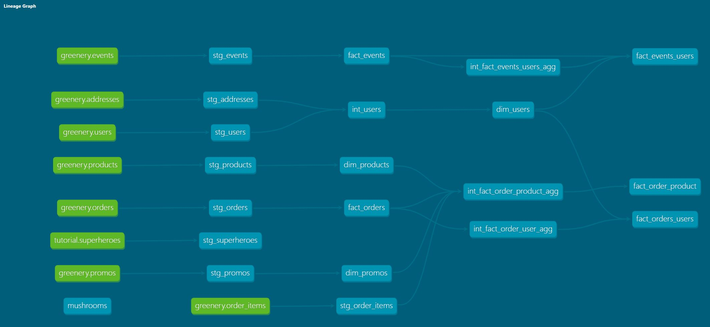

# Week2 Questions:

## Q: What is our user repeat rate?

Originally answered this with straight sql

~~~~sql
with user_purchases as (

select 
  user_guid,
  count(distinct order_guid) as purchase_count
from dbt_jason_s.stg_orders
group by 1

)
, user_count as (

  select
    sum(case when purchase_count > 1 then 1 else 0 end) as repeat_purchasers,
    count(distinct user_guid) as total_purchasers
    from user_purchases
)

select repeat_purchasers *1.0 / total_purchasers as repeat_purchase_rate
from user_count
~~~~
**Answer:** 79.8% of our customers are repeat purchasers

Rewrote the query after building out the fact_orders_users table. Added in a flag into the fact_orders_users table identifying users who are repeat purchasers to eliminate the need for a case statement.

~~~~sql
select
  sum(1.0 * is_repeat_spender) /count(user_guid) as repeat_rate
from dbt_jason_s.fact_orders_users
~~~~

**Answer:** 79.8% of our customers are repeat purchasers

---

## Q: What are good indicators of a user who will likely purchase again? What about indicators of users who are likely NOT to purchase again? If you had more data, what features would you want to look into to answer this question?

- Time to first purchase from initial signup.
- Frequency of site visits.
- Frequency of adding items to cart.
- Browsing patterns to related items of initial purchase.
- Response to marketing campaigns.
- Positive reviews on purchased items.

## Q: Explain the marts models you added. Why did you organize the models in the way you did?

- **core:** 
    - The building blocks location for all additonal downstream marts.
    - **_intermediate:_** Where intermediate aggregations and business logic added
- **marketing:** 
    - Built off of core, fact tables currated for the marketing team.
    - Added 2 fact tables, one aggregated at the orders level and a second one from the product level to be able to calculate revenue from each product we offer.
    - **_intermediate:_** Where intermediate aggregations and business logic added
- **product:** Built off of core, fact tables currated for the product team.
    - **_intermediate:_** Where intermediate aggregations and business logic added

# Part 2
## Q: We added some more models and transformed some data! Now we need to make sure they’re accurately reflecting the data. Add dbt tests into your dbt project on your existing models from Week 1, and new models from the section above

- What assumptions are you making about each model? (i.e. why are you adding each test?)
    - Making the assumption that each fact aggregate table should only have 1 record per grain of the table. E.g. fact_orders should only have 1 record for each order.
- Did you find any “bad” data as you added and ran tests on your models? How did you go about either cleaning the data in the dbt model or adjusting your assumptions/tests?
    - I only added a few unique and not_null tests. I did add in an accepted values test on event_types, it will not cause the test to fail at this point, however if a new value does get added the test will catch it.

## Q: Your stakeholders at Greenery want to understand the state of the data each day. Explain how you would ensure these tests are passing regularly and how you would alert stakeholders about bad data getting through.
- To ensure accuracy of the data numerous tests have been added and will continaully added/updated as new information is discovered about the data. Tests are run daily and if any of the tests fail our systems will immediately send an email as well as post a notification within slack for us to investigate the data issue. All downstream tables will not run once a test has failed ensuring bad data does not flow into the system causing incorrect data to be reported out.

  
# Greenery DAG
