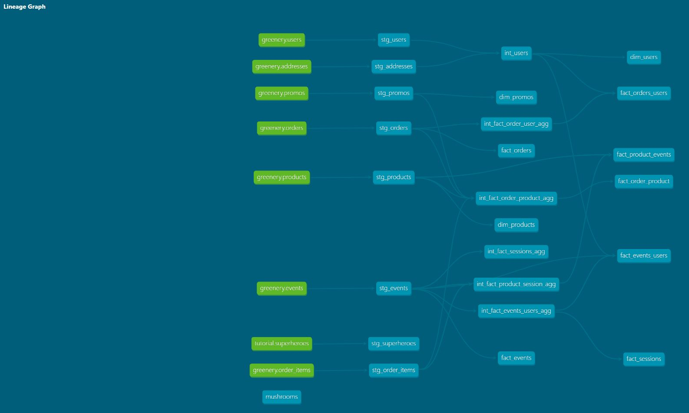

# Week3 Questions:

## Q: What is our overall conversion rate?

I ended up creating a model which has each unique session and a boolean flag of 1 or 0 if that session ended up with a purchase. Thinking back on this now, it potentially would have been better to keep the order_guid as part of the underlying fact table so end users wouldn't have to trace up the stack to figure out what items were purchased in that session.

~~~~sql
select 
  round(
    sum(has_purchase)::numeric / count(session_guid)
  , 3) as conversion_rate
from dbt_jason_s.fact_sessions
~~~~
**Answer:** 62.5% Conversion rate.

## Q: What is our conversion rate by product?

I took a slightly different approach with this one and created a summary table with this information. I debated if I should keep the prefix of fact_ with this table or to use a prefix of smry_ to signify that everything is all ready preaggregated.

~~~~sql
select 
    product_name,
    product_conversion_rate
from dbt_jason_s.fact_product_events
~~~~
Answer:
| product_name        | product_conversion_rate |
|---------------------|------------------------:|
| Alocasia Polly      | 0.39                    |
| Aloe Vera           | 0.49                    |
| Angel Wings Begonia | 0.39                    |
| Arrow Head          | 0.55                    |
| Bamboo              | 0.52                    |
| Bird of Paradise    | 0.45                    |
| Birds Nest Fern     | 0.41                    |
| ...                 | ...                     |

## Q: Why might certain products be converting at higher/lower rates than others? 

There are various reasons why products convert at different rates. Some additional things to potentially look into if the data exists.
- Customer reviews on the product
- Price compared to competitors
- Product availablity
- Is the product consumable? Meaning frequently need to replace.
- Difficulty level to maintain
- Is product a companion product?
- Promotional discounts
- Location of product on website
- Recomendation engine. Does the product get recommended with other products.

  
# Greenery DAG
Week 3 DAG

Week 2 DAG

