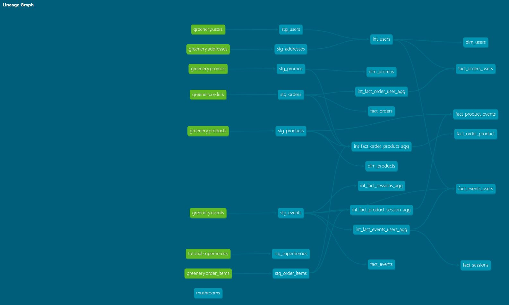

# Week4 Questions:

## Q: How are our users moving through the product funnel?
In week 3 I basically created the funnel from a sessions perspective, so that is what I went with this week.  The concepts can easily be transformed at the user level, I just didn't have time to do that so this is the sessions view of the funnel.

| Funnel Step                   | Number of Sessions |
|-------------------------------|-------------------:|
|     Total   Sessions          |     578            |
|     Add   to Cart Sessions    |     467            |
|     Checkout   Sessions       |     361            |

## Q: Which steps in the funnel have largest drop off points?
Depending on how we want to look at the funnel I have provided pecentage point differences from the previous step as well as from the top of the funnel.

In both cases because this is only a 3 step funnel the largest drop off is at the Checkout Step with a 23 ppt drop from the number of sessions that have an Add to Cart event.

| Funnel Step                   | Conversion Percentage | Percentage Point Difference |
|-------------------------------|----------------------:|----------------------------:|
|     Total   Sessions          | 1                     | N/A                         |
|     Add   to Cart Sessions    |     0.81              |     19 ppt                      |
|     Checkout   Sessions       |     0.77              |     23 ppt           |

## Q: dbt next steps for you?

### if your organization is using dbt, what are 1-2 things you might do differently / recommend to your organization based on learning from this course?

- My team isn't directly utilizing dbt but our data engineering team does. I am looking to bring this to our analytics team to be able to add modulation and software engineering principles to our workflow.

### if you are thinking about moving to analytics engineering, what skills have you picked that give you the most confidence in pursuing this next step?

- I have proposed this role change for myself and am currently working through this as it's hard in a large organization to shift the needle but it finally adds some clarity and actual roles and responsibilites to my day to day. One of the biggest shifts that I'm pushing towards with this role is taking the burden off of the data engineering team who are not as familiar with the day to day requirements and putting that power back into the analysts hands. Speeding up turn around times and making us more agile. This will also enable us change the way we think about data and changing the perspectives of the team from writing crazy queries to thinking of data as a product and making our schemas reflect this.

  
# Greenery DAG
Week 4 DAG

Week 3 DAG

Week 2 DAG
